# deploy-jenkins-server-with-terraform

## Getting started

This project involves developing several Terraform modules to facilitate the automated and reproducible deployment of a Jenkins server on AWS infrastructure. Upon execution, the modules will export relevant metadata to a text file stored locally on the machine running Terraform.

## Prerequisites

- Install terraform on your laptop.
- Create an AWS account if not done yet. Create a bucket that will contain the **terraform state** file.
- Create a folder where you create the credentials' file that will contain the access and secret IDs. The file should look like this:

**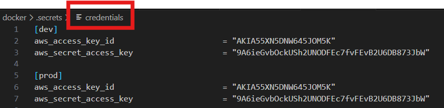**

## Execution

After cloning the repository, do the following:

### 1) Intialize your terraform folder
The required plugins and modules will be installed as well as the initialization of the backend that will store the tfsate file.

- `cd <terraform_folder_name>` 
- `terraform init`

**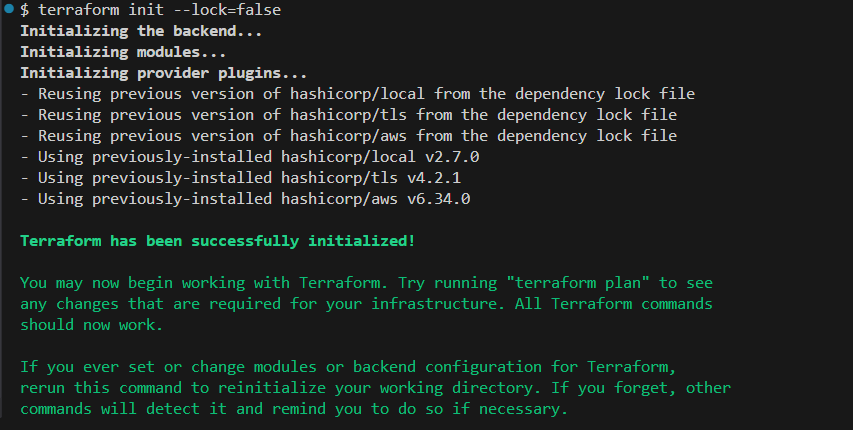**

### 2) Ensure there are no syntax errors

- `terraform plan`

**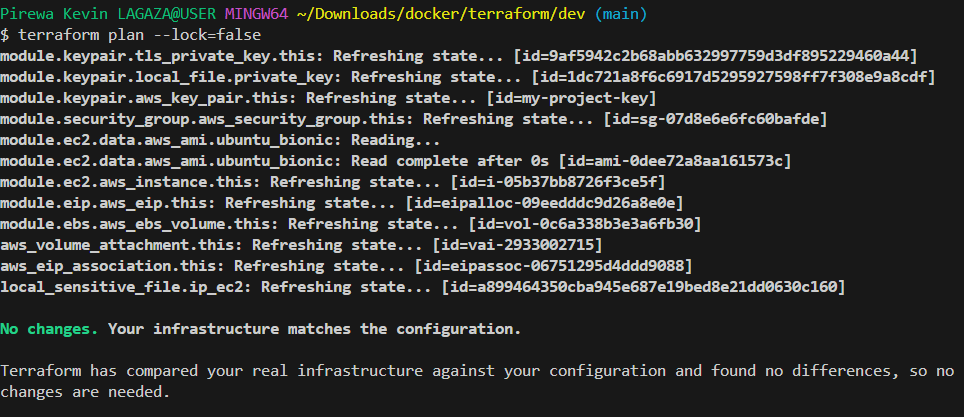**

### 3) Provionning of resources

- `terraform apply`

**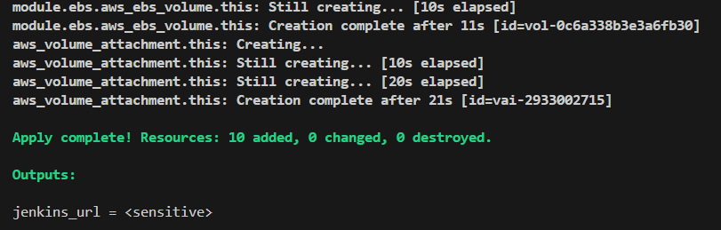**

### 4) Resource verification

After connecting to the AWS console, we can now see the resources that are supposed to be created.
- EC2 instance

**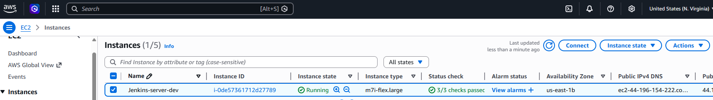**

- Key Pair

**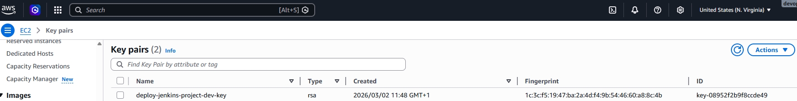**

- Securtity Group

**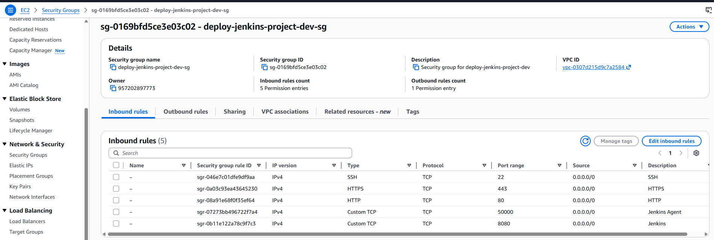**

**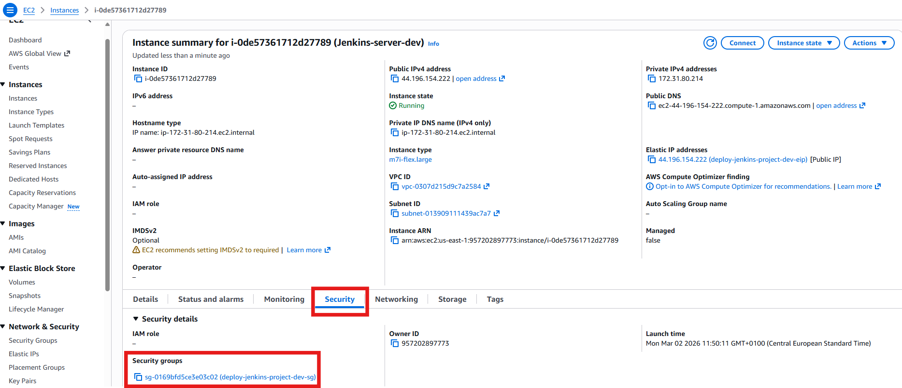**

- Elastic IP

**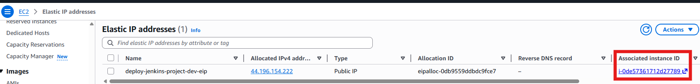**

- Elastic Block Store

**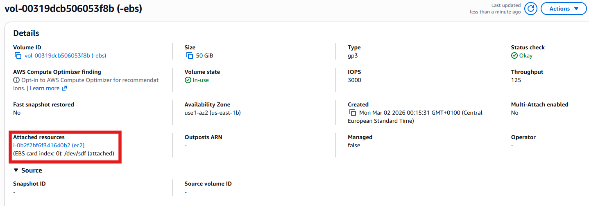**

- Local files (.txt and .pem files)

**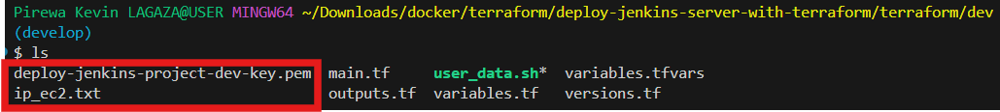**

### 5) Testing the Jenkins installation

- Connect to the ec2 instance.
- Run `docker exec jenkins cat /var/jenkins_home/secrets/initialAdminPassword`.
- Copy the password and paste it onto the jenkins starting interface.

**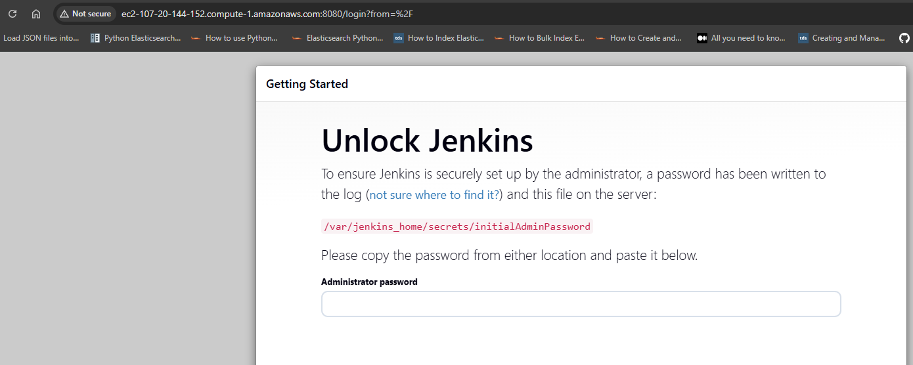**

**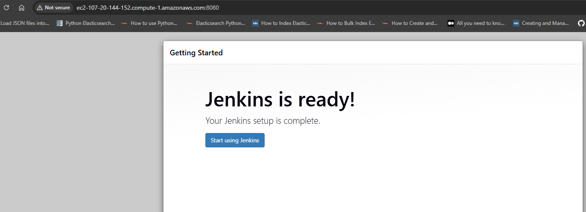**

**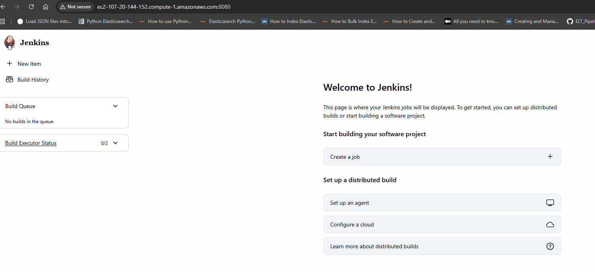**

### 6) Destroy all the resources previously created

- `terraform destroy`

We can now destroy the resources in order not to get billed unknowingly.

**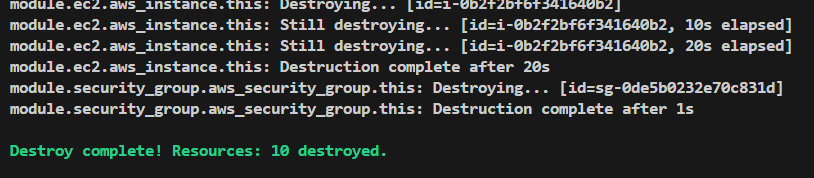**

